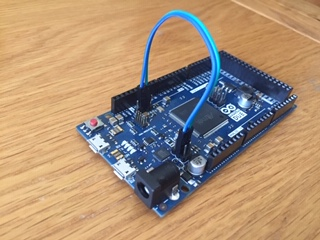

# at16u2_cmsis_dap
CMSIS-DAP debugger firmware for atmega16u2 mcu on Arduino DUE board
The project is modification for existing arduino-cmsis-dap project to target atmega16u2 mcu.

You could flash the atmega16u2 mcu with already compiled at16u2_cmsis_dap.elf.hex file if you want.
You could find a lot of detailed information in the internet how to flash HEX file to that mcu on Arduino boards.

If you want to compile it yourself do next steps:
```
git clone https://github.com/lanserge/at16u2_cmsis_dap.git
cd at16u2_cmsis_dap
git submodule init
git submodule update
mkdir build
cd build
cmake ..
```

The above sequence will install all necessary subprojects and also will download and install Arduino SDK.
Then do next:
```
make
make hex
```
And if you have AVR ISP II programmer you could connect it to the ICSP connector near the atmega16u2 on the DUE board. And flash with the next command:
```
make flash_avrisp2
```
How to work with the debugger:

On the Arduino DUE board the SWD debug port has four pins and
two of them (GND and RESET) already connected to the atmega16u2 mcu.



After that connect your Arduino DUE USB programming port to your PC and you will have CMSIS DAP debugger connected and ready.
In the internet there is a lot of info about how to setup it for Eclipse or other IDEs.

Example how to use it under Linux with OpenOCD:

To start GDB server
```
openocd -s /usr/share/openocd/scripts -s /usr/local/share/openocd/scripts -f interface/cmsis-dap.cfg -f board/atmel_sam3x_ek.cfg
```

To flash the code to the ARM with single command and without GDB run next as single line without comments and with your compiled filename substituted 
```
openocd -s /usr/share/openocd/scripts -s /usr/local/share/openocd/scripts
        -f interface/cmsis-dap.cfg -f board/atmel_sam3x_ek.cfg
        -c "init" # connect to the target
        -c "halt" # stop the microcontroller
        -c "flash write_image erase <your_compiled_code elf or hex file>" # erase/flash the image
        -c "at91sam3 gpnvm set 1" # set to boot from flash
        -c "exit"
```
